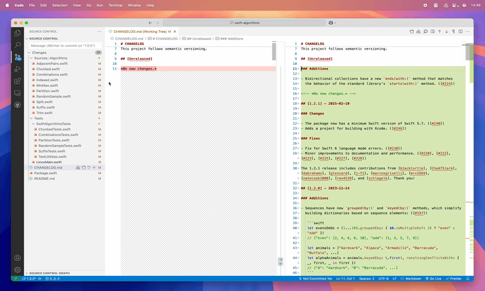

<a href="https://kaleidoscope.app">
<picture>
    <source srcset="https://github.com/kaleidoscope-app/vscode-ksdiff/raw/main/README/KaleidoscopeLogo-White@2x.png" media="(prefers-color-scheme: dark)">
    
</picture>
</a>
 

# Kaleidoscope for Visual Studio Code

A Visual Studio Code extension that helps dealing with __changes__ and __merges__. Compare files, text selections, and run gitdifftool or git mergetool.

By default, it integrates with Kaleidoscope for macOS, the world's most powerful file comparison app. Kaleidoscope helps comparing and merging text, images and folders. [Learn more about Kaleidoscope…](https://kaleidoscope.app)

<a href="https://kaleidoscope.app">
<picture>
    <!--<source srcset="https://github.com/kaleidoscope-app/vscode-ksdiff/raw/main/README/vscode-3way-merge~dark.png" media="(prefers-color-scheme: dark)">-->
    
</picture></a>

<b><i>Kaleidoscope in 3-way merge mode, opened from a merge in the SCM area of Visual Studio Code</i></b>

## Features

The extension provides the following functionalities through a comprehensive set of menu entries and toolbar buttons:

* Comparison of entire files using Kaleidoscope or another tool
* Comparison of arbitary pieces of text in Kaleidoscope or another tool
* Show git difftool results in Kaleidoscope or default diff tool defined
* Run git mergetool in Kaleidoscope or default merge tool defined

## How to use

### In Explorer View

* Bring up the context menu and select `Open with Kaleidoscope`. This will immediately open the selected file(s) in Kaleidoscope. Repeat with other file(s) to compare.

### In SCM View

* In the header area, click the `Show all Changes (Kaleidoscope)` button to see all git changes in the current working copy.
* Bring up the context menu on a header, such as `Changes` or `Staged Changes`, select `Show all Changes (Kaleidosocope)` to show all git changes in that group.
* Bring up the context menu on a file, select `Show Changes (Kaleidoscope)` to compare the working copy version of that file with the last repository version.
* In the Merge Changs group, bring up the context menu on a file, select `Start Merge (Kaleidoscope)` to open that file in 3-way merge in Kaleidoscope.

### In the Editor

* In the header area, click the `Open in Kaleidoscope` button to open the file currently being edited in Kaleidoscope. Repeat with a second file to compare those files.
* With a text selection, bring up the context menu and select `Compare in Kaleidoscope`. Repeat to compare those selections.

## Requirements

This extension is made for macOS. To unleash its full potential, Kaleidoscope for Visual Studio Code needs Kaleidoscope to be present and the ksdiff tool to be installed.

Download [Kaleidoscope](https://kaleidoscope.app) and follow the Instructions in __Kaleidoscope > Integration… > ksdiff__.

## Extension Settings

There are three settings to configure the bahvior:

* Compare Tool allows you to configure the path to the tool being used to compare files and text content. By default this points to ksdiff, the tool shipping with Kaleidoscope for macOS.
* Git: Difftool allows chosing between Kaleidoscope and the default setting defined in your git configuration (often in ~/.gitconfig). The extension will call git difftool, possibly with --tool=Kaleidoscope, depending on the setting.
* Git: Mergetool offers the same choice, but in that case when using with git mergetool.

The two latter settings require git to be configured correctly. This can be easily achieved through the Kaleidoscope app, via __Kaleidoscope > Integration… > Git__

## Release Notes

### 1.0.0

Initial release.

